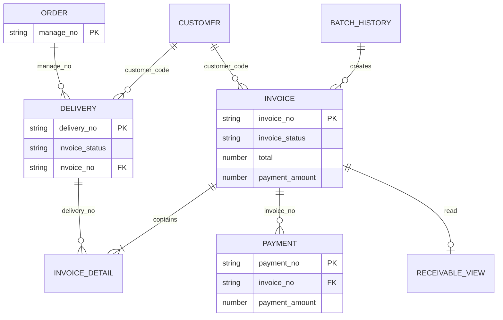

# AYANAS 基幹システム Version 1.0 — アプリ間リレーション

## リレーション概要

```
受注明細（16）
    │ manage_no
    ↓
納品管理（19）
    │ delivery_no
    ↓
請求書（35）
    │ invoice_no
    ↓
入金管理（36）
    ↓（読取）
売掛一覧（37）

顧客管理（17）── customer_code ──→ 納品 / 請求 / 入金 / 売掛
請求締め実行履歴（38）── 一括作成の監査（請求35と間接連携）
```

## リレーション一覧

| # | From（子） | To（親） | 結合キー | カーディナリティ | データの向き |
|---|-----------|---------|---------|----------------|-------------|
| 1 | 納品管理 19 | 受注明細 16 | manage_no | N : 1 | 受注 → 納品（コピー） |
| 2 | 納品管理 19 | 顧客管理 17 | customer_code | N : 1 | 参照 |
| 3 | 請求書 35 | 顧客管理 17 | customer_code | N : 1 | ルックアップ |
| 4 | 請求書 invoice_detail | 納品管理 19 | delivery_no | N : 1 | 取込コピー |
| 5 | 納品管理 19 | 請求書 35 | invoice_no | N : 1 | 確定時に書込 |
| 6 | 入金管理 36 | 請求書 35 | invoice_no | N : 1 | 参照 |
| 7 | 請求書 35 | 入金管理 36 | invoice_no | 1 : N | 入金累計を請求へ同期 |
| 8 | 売掛一覧 37 | 請求書 35 | invoice_no | 1 : 1（表示行） | 読取のみ |
| 9 | 売掛一覧 37 | 入金管理 36 | invoice_no（間接） | — | 今月回収額集計 |
| 10 | 請求締め履歴 38 | 請求書 35 | —（バッチ単位） | 1 : N | 一括作成の記録 |

## 業務フロー別リレーション

### 受注 → 納品

| 項目 | 説明 |
|------|------|
| トリガー | 納品登録 |
| キー | `manage_no` |
| 更新 | 納品 App 19 が明細を保持（受注16は更新しない） |

### 納品 → 請求

| 項目 | 説明 |
|------|------|
| トリガー | 未請求データ取込 / 一括作成 |
| キー | `delivery_no` → `invoice_detail.delivery_no` |
| 条件 | 納品 `invoice_status = 未請求` |
| 更新 | 請求 App 35 が明細・金額を生成 |

### 請求 → 納品（確定）

| 項目 | 説明 |
|------|------|
| トリガー | 請求確定 |
| キー | `invoice_detail.delivery_no` |
| 更新 | 納品 `invoice_status = 請求済`, `invoice_no` 設定 |

### 請求 → 入金

| 項目 | 説明 |
|------|------|
| トリガー | 入金保存 |
| キー | `invoice_no` |
| 更新 | 入金36が正 → 請求35へ `payment_amount` 累計同期 |

### 請求 + 入金 → 売掛

| 項目 | 説明 |
|------|------|
| トリガー | 売掛一覧画面表示 |
| キー | `invoice_no` |
| 更新 | なし（読取のみ） |

## ER 図（概念）



---

*最終更新: AYANAS 基幹システム Version 1.0*
